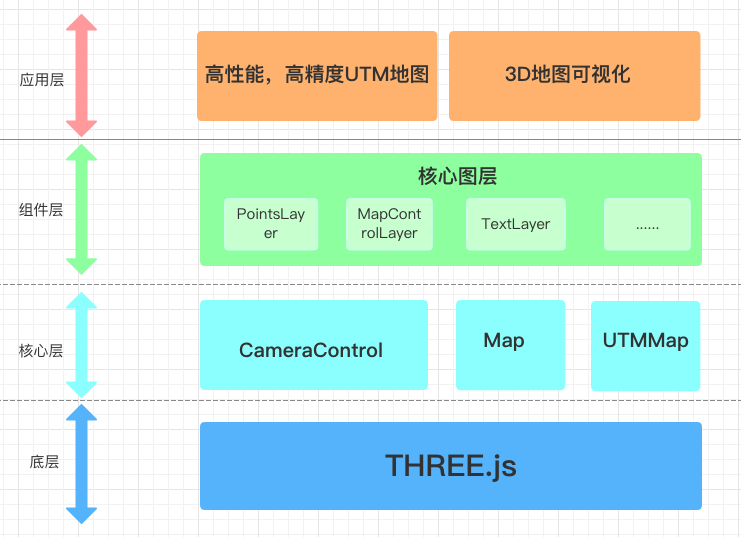

### 无人驾驶
包含多传感器（激光雷达、长短距雷达、摄像头、GPS、陀螺仪等）输入、感知预测、定位、决策规划和控制等等
ROS (Robot Operating System, 机器人操作系统)是强大而灵活的机器人编程框架，是基于消息传递通信的分布式多进程框架

定位、障碍物检测：激光雷达、毫米波雷达、摄像头、高精GPS和IMU
高精地图：基于激光雷达的点云地图、标记路面标志和信号灯的语义地图
深度感知：检测、跟踪、行为预测

### 高精地图
高精度地图可以精确自动识别交通标志、地面标志、车道线、信号灯等上百种目标，还有道路坡度、曲率等准确的数据信息。车辆可依照高精地图已知的道路信息，提前做出准确判断和决策，且不受阴雨等天气影响，减少车祸的发生，为实现自动驾驶保驾护航。

高精地图增加了大量的几何信息、车道信息、交通标志信息。整个属性从40多种变成两三百种，相对精度达0.1-0.2米，实现了精细化程度最高

### 地图坐标
WGS84是地理坐标系，是用经纬度表示的椭球体坐标系
UTM是投影坐标系，是用X、Y表示的平面直角坐标系，是一种将球面坐标转化为平面坐标的方法；

### Three.js
基于Three.js：可以利用three.js庞大的社区资源,减少开发者的开发成本，尤其是对webgl不熟悉的开发者，threejs的各种资源可以帮助快速上手框架
可以铺设Mapbox的定制化图层：同uber的deck.gl，可以在mapbox上进行3d可视化展示
丰富的地图图层插件: 第三人称视角跟踪，地图控制，点云等
高性能： 基于UTM坐标研发的高精地图，可以减少两次坐标转换，直接映射three.js的坐标系，每帧对比gps能减少100ms的运算时间,下图为框架在2w+点时的每帧处理时间，parse是解析数据时间，all是拉取到数据到渲染完成的时间(不包括浏览器paint)

