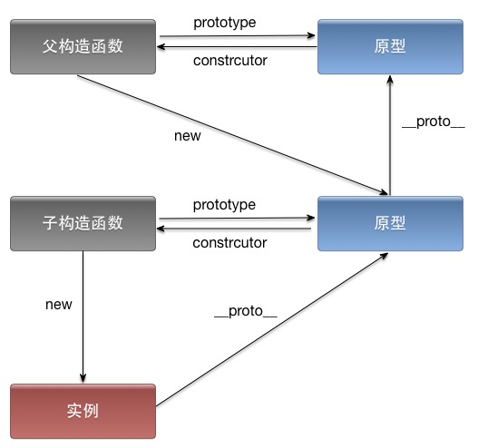
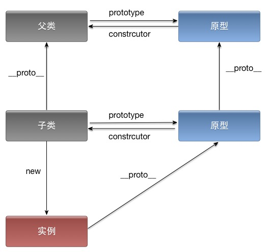

### 1. ES5的继承
ES5中通过将Super的实例赋给Sub的原型实现继承。



```
function Super() {
  this.x = "我是父类的值";
}
Super.prototype.getSuperData = function() {
  return this.x;
}

function Sub() {
  this.y = "我是子类的值";
}
Sub.prototype = new Super();
Sub.prototype.constructor = Sub;
Sub.prototype.getSubData = function() {
  return this.y;
}

var test = new Sub();
console.log(test);// {y: "我是子类的值"}
console.log(test.getSubData()); // 我是子类的值
console.log(test.getSuperData()); // 我是父类的值

console.log(test.__proto__ === Sub.prototype); // true
console.log(Sub.prototype.__proto__ === Super.prototype); // true   

```

### ES6的继承

Class作为构造函数的语法糖，同时有prototype属性和__proto__属性，因此同时存在两条继承链。

（1）子类的__proto__属性，表示构造函数的继承，总是指向父类。

（2）子类prototype属性的__proto__属性，表示方法的继承，总是指向父类的prototype属性。

ES6相比于ES5，多了一个子类的__proto__属性指向父类。



```js
 class Super {
    constructor() {
      this.x = "我是父类的值";
    }

    getSuperData() {
      return this.x;
    }
  }

  class Sub extends Super {
    constructor() {
      super();
      this.y = "我是子类的值";
    }

    getSubData() {
      return this.y;
    }
  }

  var test = new Sub();
  console.log(test); // {x: "我是父类的值", y: "我是子类的值"}
  console.log(test.getSubData()); // 我是子类的值
  console.log(test.getSuperData()); // 我是父类的值

  console.log(test.__proto__ === Sub.prototype); // true
  console.log(Sub.prototype.__proto__ === Super.prototype); // true
  console.log(Sub.__proto__ === Super); // true
```